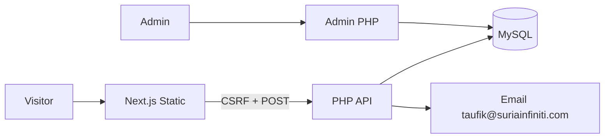

# Suria Solar Calculator — Design Spec

**Date:** 2026-07-06  
**Status:** Approved for implementation  
**Sources:** `prd.md`, `design.md`, brainstorming session decisions

---

## 1. Purpose

Standalone solar savings calculator for Suria Infiniti Sdn Bhd at `calculator.suriainfiniti.com`. Converts ad traffic into qualified leads with estimate context attached.

## 2. Architecture

| Layer | Technology |
|---|---|
| Frontend | Next.js 15, App Router, `output: 'export'`, Tailwind CSS |
| Backend | PHP 8+, PDO/MySQL, PHPMailer |
| Hosting | cPanel subdomain, static `out/` + PHP `/api/` and `/admin/` |

## 3. User Flow (MVP v1)

1. **Inputs:** Monthly bill slider (RM100–5,000), property type, roof exposure
2. **Results:** Auto-calculated kWp, monthly/annual savings, payback — Solar ATAP disclaimer
3. **Lead form:** Triggered by "Get My Exact Quote" CTA — name, phone, email, state, consent
4. **Confirmation:** Success message + WhatsApp button (`60127075391`)

## 4. Calculation Constants (config.php / DB)

| Constant | Default |
|---|---|
| Tariff rate | RM 0.571/kWh |
| Cost per kWp | RM 4,200 |
| Avg daily sun hours | 4.5 |
| Panel derate | 0.85 |
| Offset % | 0.90 |
| Exposure: Excellent / Good / Moderate | 1.0 / 1.15 / 1.3 |

## 5. Confirmed Decisions

- **Stack:** Next.js static + PHP/MySQL (not Node.js on server)
- **Bot protection:** Cloudflare Turnstile + honeypot
- **Admin auth:** Login page, session + bcrypt
- **Sales email:** taufik@suriainfiniti.com
- **WhatsApp:** 012-7075391
- **Out of scope v1:** Multi-step wizard, Rent-to-Own, Google Maps roof tool

## 6. API Endpoints

| Method | Path | Purpose |
|---|---|---|
| GET | `/api/csrf-token.php` | Issue CSRF token |
| GET | `/api/config-get.php` | Return calc constants |
| POST | `/api/lead-submit.php` | Validate, save, email |

## 7. Database Tables

- `suria_calc_leads` — per PRD §9
- `suria_calc_config` — key/value settings
- `admin_users` — bcrypt credentials
- `rate_limits` — IP hash throttling

## 8. Security (PRD §7)

CSRF, server-side validation, prepared statements, CORS whitelist, admin login, Turnstile + honeypot, rate limiting, HTTPS, PDPA consent fields, secrets outside web root.

## 9. Design System

Montserrat font, navy `#0C2637`, orange `#F47421`, wrapper `.si-calc-wrapper`. Mobile-first, min 44px tap targets. See `design.md` for component specs.

## 10. Deployment

1. `npm run build` → upload `frontend/out/` to subdomain root
2. Upload `backend/api/`, `backend/admin/`, `backend/includes/`
3. `config.php` outside public root or `.htaccess` protected
4. Import `backend/db/schema.sql`
5. Enable AutoSSL before ads
